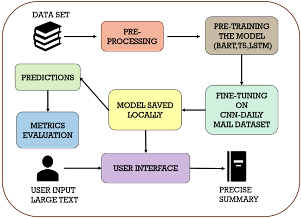

# Precise-Text-Summarization

## Overview
This project aims to develop an advanced text summarization system using deep learning techniques to summarize news articles from the CNN and Daily Mail dataset.

## Dataset
The dataset used for this project can be found [here](https://www.kaggle.com/datasets/gowrishankarp/newspaper-text-summarization-cnn-dailymail).

## System Architecture

## Text Summarization Process
1. **Data Collection**: Gather text documents from the provided dataset.
   
2. **Preprocessing**: Clean and prepare the text data for analysis, including tasks like tokenization and removing stopwords.

3. **Model Selection**: Choose a suitable summarization model, such as BART, T5, or PEGASUS, based on the project requirements.

4. **Fine-Tuning**: Train the selected model on the preprocessed dataset to adapt it for the summarization task.

5. **Evaluation**: Assess the performance of the model using metrics like ROUGE (Recall-Oriented Understudy for Gisting Evaluation) scores to measure summary quality.

6. **Deployment**: Deploy the trained model for use in applications or platforms, making text summarization accessible and efficient.

## Results
The system achieved promising results with high-quality text summaries generated from news articles.

## Usage
Clone the repository: `git clone https://github.com/harshavardhini39/Precise-Text-Summarization.git`

## Credits
This project was developed by Harshavardhini Budde.
